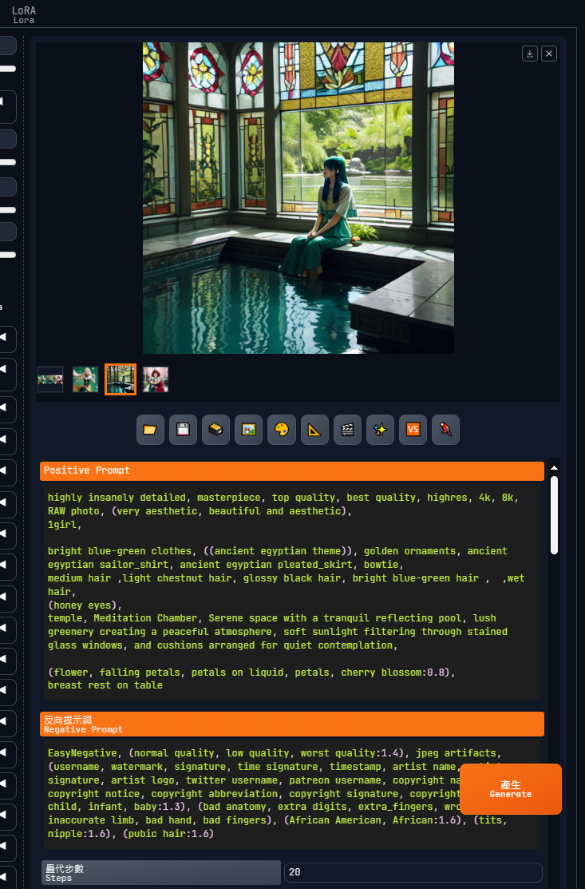

# README.md

    Stable Diffusion PNGINFO Beautify extension

https://github.com/bluelovers/sd-webui-pnginfo-beautify

This extension is designed to enhance the user experience and performance of
the [AUTOMATIC1111/stable-diffusion-webui](https://github.com/AUTOMATIC1111/stable-diffusion-webui)
or [lllyasviel/stable-diffusion-webui-forge](https://github.com/lllyasviel/stable-diffusion-webui-forge) projects.

fork from [lobehub/sd-webui-lobe-theme](https://github.com/lobehub/sd-webui-lobe-theme)
do not install with lobe theme at same time

I like the lobe theme, but it slows down and freezes the UI very much.

## Feature

The extension provides additional features and improvements to the Stable Diffusion WebUI, such as:

### Supported tabs

see https://github.com/bluelovers/sd-webui-pnginfo-beautify/blob/dev/src/const.ts

- txt2img
- img2img
- PNG info
- Extras
- [Replacer](https://github.com/light-and-ray/sd-webui-replacer)
- [Fast PNG Info](https://github.com/NoCrypt/sd-fast-pnginfo)
- [Agent Scheduler 任務排程代理](https://github.com/ArtVentureX/sd-webui-agent-scheduler)

### Supported fields

see https://github.com/bluelovers/sd-webui-pnginfo-beautify/blob/dev/src/row-config.ts

#### SyntaxHighlighter

- `Positive Prompt`
- `Negative Prompt`
- `sv_prompt`
- `Template` from [Dynamic Prompts](https://github.com/adieyal/sd-dynamic-prompts)
- `Template Generated` from [Dynamic Prompts](https://github.com/adieyal/sd-dynamic-prompts)

#### hashes

- `TI hashes`
- `Lora hashes`

#### Searchs

- `Model hash`
- `Model`
- `VAE hash`
- `VAE`
- `ADetailer model` from [ADetailer](https://github.com/Bing-su/adetailer)

#### decode

- `Template Generated Grid` from [Dynamic Prompts](https://github.com/adieyal/sd-dynamic-prompts)

### Others

- Show/Hide Original pnginfo

## Known issues

- Old installations may have a bug that prevents updating to the new version. To resolve this issue, follow these steps:
    1. Close Stable Diffusion WebUI.
    2. Delete the extension folder.
    3. Restart Stable Diffusion WebUI.
    4. Reinstall the extension.
